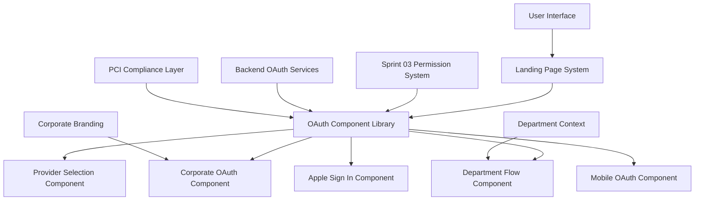

# Sprint 04 Architecture: Frontend OAuth Integration

## Architectural Decision Document
**Version**: 1.0  
**Date**: September 12, 2024  
**Agent**: Architect  
**Phase**: OAuth Implementation Phase 4

## Executive Summary

Sprint 04 implements a **Component-Based OAuth Architecture** that integrates seamlessly with the existing landing page system while maintaining PCI DSS compliance and supporting the advanced permission system from Sprint 03.

## System Architecture Overview

### Core Architecture Principles
- **Component Modularity**: OAuth functionality as reusable components
- **Progressive Enhancement**: OAuth enhances existing pages without breaking functionality
- **Security First**: All components maintain PCI DSS Level 1 compliance
- **Mobile Optimization**: Performance-first approach for mobile devices
- **Corporate Flexibility**: Customizable branding and flows per corporate client

### High-Level Component Architecture



## Component Architecture Specification

### 1. OAuth Component Library (`/src/components/oauth/`)

**Core Components**:
- `OAuthProvider`: Main OAuth orchestration component
- `ProviderSelector`: Intelligent OAuth provider selection
- `CorporateOAuth`: Corporate-specific OAuth flows
- `DepartmentFlow`: Department context selection during OAuth
- `AppleSignIn`: Apple Sign In implementation
- `MobileOAuth`: Mobile-optimized OAuth experience

### 2. Landing Page Integration (`/src/views/landing/oauth/`)

**Integration Strategy**:
- Extend existing landing page framework
- Inject OAuth components based on URL patterns
- Maintain existing corporate branding system
- Preserve current SEO and performance optimizations

### 3. Apple Sign In Architecture

**Implementation Approach**:
- Native Apple OAuth 2.0 integration
- Privacy-compliant data handling
- Cross-platform compatibility (iOS, macOS, web)
- Integration with AmexingUser system

## Technical Implementation Strategy

### Phase 1: Foundation (Week 1)
1. **OAuth Component Library Setup**
   - Create base component architecture
   - Implement provider selection logic
   - Establish corporate branding integration

2. **Landing Page Integration**
   - Extend existing landing page system
   - Implement OAuth component injection
   - Maintain backward compatibility

3. **Department Flow Integration**
   - Connect with Sprint 03 context system
   - Implement department selection during OAuth
   - Ensure permission inheritance works seamlessly

### Phase 2: Apple Integration (Week 2)
1. **Apple Sign In Backend**
   - Implement Apple OAuth 2.0 flows
   - Configure Apple Developer integration
   - Ensure privacy compliance

2. **Apple Frontend Components**
   - Create Apple-specific UI components
   - Implement Apple design guidelines
   - Optimize for Apple ecosystem

3. **Mobile Experience Optimization**
   - Optimize OAuth flows for mobile devices
   - Implement PWA considerations
   - Ensure cross-platform compatibility

## Security Architecture

### PCI DSS Compliance Integration
- All OAuth components inherit PCI DSS compliance from base system
- Sensitive data handling follows established patterns
- Audit logging integrated with Sprint 03 audit system
- Token management maintains security standards

### Security Component Layer
```javascript
// Security wrapper for all OAuth components
const SecureOAuthComponent = (Component) => {
  return class extends PCI_Compliant_Component {
    constructor(props) {
      super(props);
      this.auditLogger = new PermissionAuditService();
      this.encryptionService = new DataEncryptionService();
    }
    
    render() {
      return (
        <SecurityBoundary>
          <AuditWrapper component="oauth">
            <Component {...this.props} />
          </AuditWrapper>
        </SecurityBoundary>
      );
    }
  };
};
```

## Performance Architecture

### Mobile Optimization Strategy
- **Lazy Loading**: OAuth components loaded on demand
- **Code Splitting**: Separate bundles for different OAuth providers
- **Caching**: Intelligent caching of OAuth configurations
- **Progressive Loading**: Core functionality first, enhancements after

### Performance Targets
- **Initial Load**: <1.5s for OAuth component initialization
- **OAuth Flow**: <3s total authentication time
- **Mobile Experience**: <2s for provider selection
- **Corporate Pages**: Maintain existing performance benchmarks

## Integration Points

### Sprint 03 Permission System Integration
```javascript
// Integration with context switching system
const OAuthWithContext = {
  async authenticateWithContext(provider, selectedDepartment) {
    const oauthResult = await OAuthService.authenticate(provider);
    const contextResult = await PermissionContextService.initializeContext(
      oauthResult.user, 
      selectedDepartment
    );
    return { ...oauthResult, context: contextResult };
  }
};
```

### Landing Page System Integration
- OAuth components register with existing landing page framework
- Branding system extends to OAuth components
- URL routing integrates OAuth flows seamlessly
- Analytics and tracking maintain consistency

## Apple Sign In Specific Architecture

### Privacy Architecture
- **Hide My Email**: Support for Apple's email relay service
- **Limited Data**: Handle minimal user data scenarios
- **Consent Management**: Clear privacy consent flows
- **Data Minimization**: Only request necessary permissions

### Apple Integration Components
```javascript
const AppleOAuthArchitecture = {
  AppleSignInButton: 'Apple-compliant sign in button',
  AppleOAuthHandler: 'Handle Apple OAuth responses',
  ApplePrivacyManager: 'Manage Apple privacy features',
  AppleTokenValidator: 'Validate Apple ID tokens',
  AppleuserMapper: 'Map Apple users to AmexingUser system'
};
```

## Corporate Customization Architecture

### Branding System Extension
- OAuth components inherit corporate branding
- Customizable OAuth provider priorities
- Department-specific OAuth flows
- Corporate domain-based automatic provider selection

### Configuration Architecture
```javascript
const CorporateOAuthConfig = {
  branding: {
    colors: 'Corporate color scheme',
    logos: 'Corporate logos and imagery',
    messaging: 'Custom OAuth messaging'
  },
  providers: {
    priority: ['google', 'microsoft', 'apple'],
    restrictions: 'Domain-based provider restrictions',
    customization: 'Provider-specific customizations'
  },
  departments: {
    mapping: 'Department to OAuth group mapping',
    flows: 'Department-specific OAuth flows',
    permissions: 'Integration with Sprint 03 permissions'
  }
};
```

## Monitoring and Analytics Architecture

### OAuth Analytics Integration
- Track OAuth provider usage by corporate client
- Monitor conversion rates across different flows
- Performance monitoring for mobile vs desktop
- Department selection patterns analysis

### Error Handling and Monitoring
```javascript
const OAuthMonitoring = {
  errorTracking: 'Comprehensive OAuth error tracking',
  performanceMonitoring: 'OAuth flow performance metrics',
  usageAnalytics: 'OAuth usage patterns and trends',
  complianceMonitoring: 'PCI DSS compliance validation',
  auditIntegration: 'Integration with Sprint 03 audit system'
};
```

## Testing Architecture

### Component Testing Strategy
- Unit tests for each OAuth component
- Integration tests for landing page integration
- Cross-browser testing for Apple Sign In
- Mobile device testing across platforms
- Performance testing for mobile optimization

### Test Environment Setup
```bash
# Sprint 04 specific testing commands
yarn test:oauth:frontend        # Frontend OAuth components
yarn test:oauth:apple          # Apple Sign In testing
yarn test:oauth:mobile         # Mobile experience testing
yarn test:oauth:corporate      # Corporate integration testing
yarn test:oauth:performance    # Performance benchmarking
```

## Deployment Architecture

### Progressive Rollout Strategy
1. **Corporate Beta**: Roll out to select corporate clients
2. **A/B Testing**: Compare new OAuth flows with existing
3. **Performance Monitoring**: Monitor mobile performance impact
4. **Full Deployment**: Complete rollout after validation

### Environment Configuration
- Development environment with all OAuth providers
- Staging environment for corporate client testing
- Production environment with monitoring and alerting

## Success Criteria

### Technical Success Metrics
- **Component Reusability**: 90%+ code reuse across landing pages
- **Performance**: Meet all mobile performance targets
- **Compatibility**: 100% compatibility with Sprint 03 permissions
- **Security**: Maintain PCI DSS Level 1 compliance
- **Apple Compliance**: Pass all Apple privacy requirements

### Business Success Metrics
- **User Experience**: Improved OAuth conversion rates
- **Corporate Adoption**: Successful corporate client rollout
- **Mobile Usage**: Increased mobile OAuth completions
- **Support Tickets**: Minimal OAuth-related support issues

## Risk Analysis and Mitigation

### Technical Risks
- **Risk**: Apple Sign In compliance complexity
  - **Mitigation**: Early Apple Developer Program engagement, privacy-first design
- **Risk**: Mobile performance degradation
  - **Mitigation**: Aggressive performance testing, lazy loading strategy
- **Risk**: Corporate branding conflicts
  - **Mitigation**: Extensible branding system, client validation process

### Implementation Risks
- **Risk**: Sprint 03 integration complexity
  - **Mitigation**: Early integration testing, gradual rollout
- **Risk**: Landing page system compatibility
  - **Mitigation**: Backward compatibility testing, progressive enhancement

## Conclusion

The Component-Based OAuth Architecture provides a scalable, maintainable, and secure foundation for Sprint 04 implementation. This architecture maintains consistency with existing systems while enabling the advanced OAuth features required for corporate clients and Apple Sign In integration.

The modular approach ensures long-term maintainability while the security-first design maintains PCI DSS compliance. The progressive enhancement strategy minimizes risk while maximizing functionality.

---

**Document Control**
- **Architecture Version**: 1.0
- **Implementation Phase**: Sprint 04 (Phase 4)
- **Review Date**: September 26, 2024
- **Approval Required**: Technical Lead, OAuth Specialist, PCI Compliance Specialist