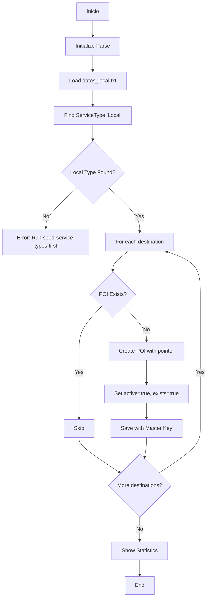

# Seed de POIs Locales

Este documento explica cómo usar el script de seed para crear destinos locales en la base de datos.

## Descripción

El script `seed-pois-local.js` lee la lista de 45 destinos locales desde `datos_local.txt` y los crea en la base de datos con el tipo de traslado "Local".

## Requisitos Previos

1. **Tipos de Traslado creados**: Ejecutar primero el seed de tipos de traslado
   ```bash
   node scripts/local/development/seed-service-types.js
   ```

2. **Base de datos MongoDB**: Debe estar corriendo y accesible
3. **Parse Server**: Debe estar corriendo en `http://localhost:1337/parse`
4. **Archivo de datos**: `docs/tarifario/datos_local.txt` debe existir

## Uso

### Crear POIs Locales

```bash
node scripts/local/development/seed-pois-local.js
```

**Resultado esperado:**
- ✅ 45 POIs creados con tipo "Local"
- ⏭️  POIs existentes se omiten (idempotente)
- 📊 Estadísticas de creación

**Ejemplo de salida:**
```
📊 Results:
   ✅ Created: 45
   ⏭️  Skipped (already exist): 0
   ❌ Errors: 0
   📝 Total processed: 45
```

### Verificar POIs Creados

Accede al dashboard de administración:
```
http://localhost:1337/dashboard/admin/pois
```

Deberías ver:
- 45 destinos locales
- Columna "Tipo de Traslado" mostrando badge azul "Local"
- Todos los POIs con estado "Activo"

### Limpiar POIs Locales (Desarrollo)

Para hacer soft delete de todos los POIs locales:

```bash
node scripts/local/development/seed-pois-local.js --cleanup
```

**ADVERTENCIA**: Esto marcará todos los POIs con tipo "Local" como:
- `active: false`
- `exists: false`

Los POIs seguirán en la base de datos pero no serán visibles en la UI.

### Re-crear POIs después de Cleanup

Simplemente ejecuta el script de seed nuevamente:

```bash
node scripts/local/development/seed-pois-local.js
```

## Características del Script

### ✅ Idempotencia
El script puede ejecutarse múltiples veces de forma segura:
- Verifica si cada POI ya existe (por nombre, case-insensitive)
- Omite POIs existentes
- Solo crea los que faltan

### ✅ Seguridad
- **Protección de producción**: No se puede ejecutar en `NODE_ENV=production`
- **Uso de Master Key**: Operaciones con privilegios administrativos
- **Audit logging**: Registra todas las operaciones en Winston logs

### ✅ Manejo de Errores
- Captura y reporta errores individuales por POI
- No detiene el proceso completo si un POI falla
- Muestra estadísticas de éxitos, omisiones y errores

## Estructura de Datos

### Archivo datos_local.txt
```
Capilla de Jimmy Ray
Casa Adela
Casa de Aves
...
Zona Centro
```

Formato:
- Un destino por línea
- Sin formato especial (plain text)
- 45 líneas totales

### POI Creado en Base de Datos
```javascript
{
  name: "Capilla de Jimmy Ray",
  active: true,
  exists: true,
  serviceType: Pointer to ServiceType "Local",
  createdAt: Date,
  updatedAt: Date
}
```

## Flujo de Ejecución



## Troubleshooting

### Error: "ServiceType 'Local' not found"

**Causa**: El tipo de traslado "Local" no existe en la base de datos

**Solución**:
```bash
node scripts/local/development/seed-service-types.js
```

### Error: "Cannot read datos_local.txt"

**Causa**: El archivo no existe o tiene permisos incorrectos

**Solución**:
1. Verificar que existe: `ls docs/tarifario/datos_local.txt`
2. Verificar permisos: `chmod 644 docs/tarifario/datos_local.txt`

### POIs no aparecen en Dashboard

**Posibles causas**:
1. **Filtro de estado**: Dashboard solo muestra POIs con `exists: true` y `active: true`
2. **Caché del navegador**: Hacer Ctrl+F5 o limpiar caché
3. **Session token expirado**: Cerrar sesión y volver a iniciar

**Verificación directa**:
```bash
# Contar POIs locales en base de datos
mongo amexing-dev --eval "db.POI.find({exists: true, active: true}).count()"
```

### Error: "SECURITY ERROR: Cannot run in production"

**Causa**: Variable `NODE_ENV=production`

**Solución**: Este script solo debe ejecutarse en desarrollo
```bash
NODE_ENV=development node scripts/local/development/seed-pois-local.js
```

## Integración con Seed Principal

Para incluir estos POIs en el seed principal del sistema, agregar al archivo de seed general:

```javascript
// En scripts/global/seed-all.js o similar
const { seedServiceTypes } = require('../local/development/seed-service-types');
const { seedPOIsLocal } = require('../local/development/seed-pois-local');

async function seedAll() {
  await seedServiceTypes();  // Primero los tipos
  await seedPOIsLocal();      // Luego los POIs locales
  // ... otros seeds
}
```

## Mantenimiento

### Agregar nuevos destinos locales

1. Editar `docs/tarifario/datos_local.txt`
2. Agregar nuevos destinos (un nombre por línea)
3. Ejecutar el script:
   ```bash
   node scripts/local/development/seed-pois-local.js
   ```

El script solo creará los POIs nuevos y omitirá los existentes.

### Modificar destinos existentes

**No usar el script** para modificaciones. En su lugar:

1. **Opción 1 - Dashboard**:
   - Ir a `http://localhost:1337/dashboard/admin/pois`
   - Editar manualmente cada POI

2. **Opción 2 - Script de migración**:
   - Crear script específico de migración en `scripts/migrations/`

## Logs y Auditoría

Todas las operaciones se registran en Winston logs:

```javascript
// Log de creación
logger.info('Local POI seeded', {
  poiId: '...',
  name: 'Capilla de Jimmy Ray',
  serviceTypeId: 'XDsvoSVQsR'
});

// Log de error
logger.error('Error seeding local POI', {
  name: 'Casa Adela',
  error: 'Connection timeout'
});
```

Consultar logs en: `logs/combined.log` y `logs/error.log`

## PCI DSS Compliance

Este script cumple con PCI DSS Level 1:
- ✅ No maneja datos sensibles de tarjetas
- ✅ Usa autenticación con Master Key
- ✅ Registra todas las operaciones (audit trail)
- ✅ Protección contra ejecución en producción
- ✅ Validación de permisos antes de operaciones

## Soporte

Para problemas o preguntas:
1. Revisar logs: `tail -f logs/combined.log`
2. Verificar estado de Parse Server: `curl http://localhost:1337/health`
3. Consultar documentación de Parse: https://docs.parseplatform.org

---

**Última actualización**: 2024-10-25
**Versión del script**: 1.0.0
**Autor**: Amexing Development Team
